# Oyster Farm Management process App

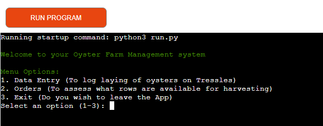

## Project Goals
This is a Python App for an Oyster Farm. It is designed as a prototype to pitch to accompany a website for an Oyster farm business. 
The App is intended for the Business owner  be to able to track rows of trestles, monitor the amount, type, 
when and where the bags of oysters are places so based on different variables will be ready in a certain time. 
All through a user-friendly application. 

# User Experience Design

## User Stories
As a user of this App:

* I would like to add data to a spreadsheet to record what has been laid. 

* I would like to ensure I have entered the all nessesary data by confirmation. 

* I would like to be able to retrieve data from my spreadsheet.

* I would like to be able to enter the date orders are due

* I would like to get return data on what rows to harvest along with their corresponding dates

* I would like to get the return dates to be all within the same month as date I enter. 

## Colour Scheme

A combination of Red and Green have been used to apply color to the terminal text. This highlight user feedback making it easier to read

[Colorama](https://pypi.org/project/colorama/) 

* Welcome message is displayed in Green

* Invalid data is displayed in Red

* Successful loging of data is displayed in Red

* Exiting the App is displayed in Green

### Data Model

The data model interact with Google Sheets to manage oyster farm data

1. Entities
    * Oysters - Type, date of laying and row location
    * Orders - Request for harvesting, date ready and rows

2. Attributes: 
    * Date - laid or requested is stored in the following format (YYYY-MM-DD)
    * Row - Giving a unique identifier, one letter and two digits (C09)
    * Oyster type - If oyster laid is seed or half grown (the google sheets adds 9 months for half grown and 18mths for seed)
    * amount -  No of Oyster Bags laid

3. Interactions: (with google sheets)
    * Data Entry - logs new entries of oysters being laid
    * Calculated Yeild -  Calculates yeilds based on entries logged. 
    *Orders - Manages and assesses orders for harvesting

### Flow Chart

Designed in Lucid charts, to give deminstrate the process. 

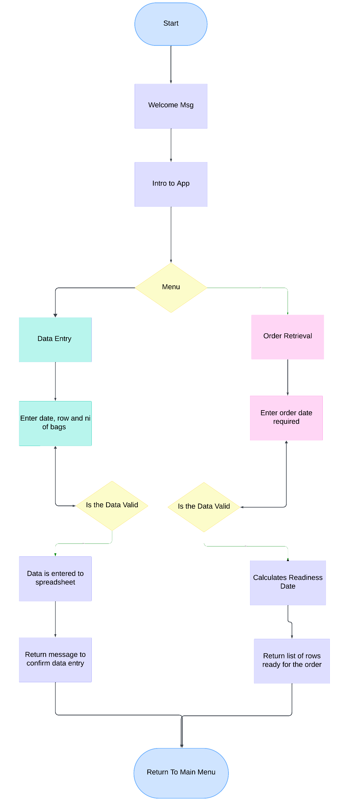

## Data flow
1. Initilisation- acesses to Google sheets using credentials stored in creds.json. Sets up scopes nessesary for reading and writing to the sheets. 
2. User interaction - welcome message and presented with a menu to chose between data entry and order requests. various attributes are collected (date, row, type, amount) with validation checks in place. 
3. Each input is validated through a series of checks
    * Date format validation using datetime.strptime().
    * Row format validation using regular expressions.
    * Oyster type validation against predefined values.
    * Amount validation to ensure it is a positive integer.
4. Data storage - Once input is validated , they are apprended to the Data Entry sheet. The application can retrieve record from the Calculated yeilds and store the order request in Orders sheet. 

## Google sheets 
### Data Entry
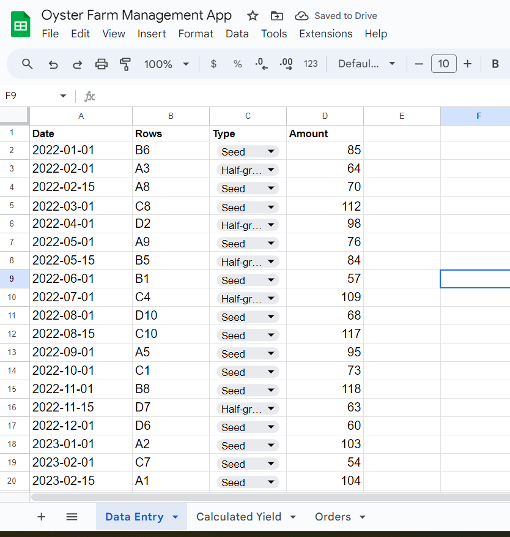

### Calculated Yeild
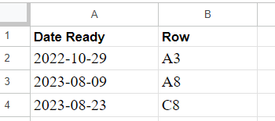 

### Orders 
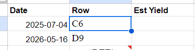

# Technologies Used

## Languages

*  [Python3](https://en.wikipedia.org/wiki/Python_(programming_language))

## Frameworks, Libraries and Programs Used

* [GitPod](https://gitpod.io/) was used for writing code, committing, and then pushing to GitHub.

* [GitHub](https://github.com/) was used to store the project after pushing.

* [Heroku](https://id.heroku.com/) was used to deploy the application.

* [PEP8 online check](http://pep8online.com/) was used to validate the Python code.

* [Colorama](https://pypi.org/project/colorama/) library was used to apply color to the terminal text. 

* [W3Schools](https://www.w3schools.com/python/python_try_except.asp/) Used to understand exception handling. 

*  [Lucid Charts](https://www.lucidchart.com/pages/) Used to understand exception handling. 

# Features
### Welcome Message: 
 Display a welcome message upon opening.
### Menu Options:
 Three main options - Data Entry and Orders or Exit application. 
### Data Entry: 
Input details about oyster bags.
### Data validation:
Functions to validate the format of dates and other inputs before logging them to spreadsheet. 
### Orders: 
Retrieve information about ready oysters based on user input.
### Google Sheets Integration: 
Connects to Google Sheets using gspread and oauth2client.
### Console Interaction: 
The application interacts with the user through standard input and output in the terminal.
### Return loop
Allows user to enter new data or return to main menu or exit app

## Future endeavours
- Confirm or cancel entries
- Option to view previously entered data
- Cancel at anytime option. 

## Welcome 

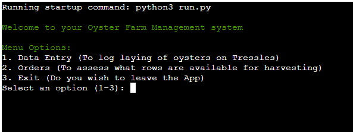

## Data Entry

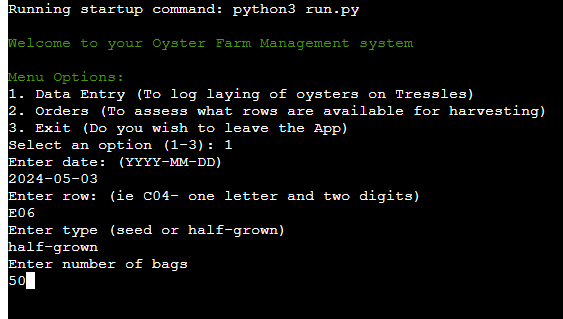

## Caluculated yeild 

## Orders

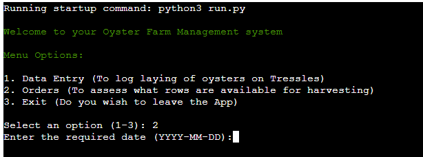

## Successful

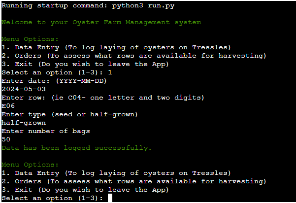

## Errors

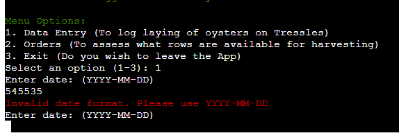

### gspread
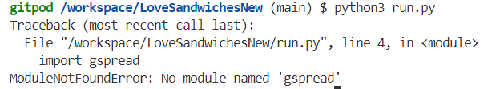

  Pip3 > requirements.txt

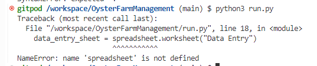

The variable ‘SPREADSHEET is defined, but later in the code I tried to access in lowercase, changed to all the same case.

### Spelling error
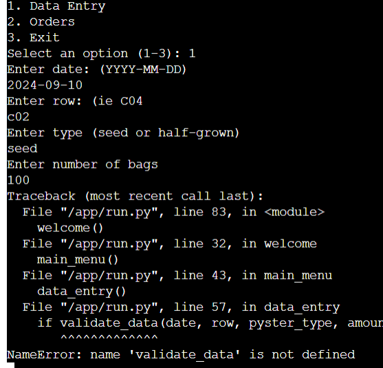

Line 57 indicates a spelling error that is breaking the code. 

## Testing

### Testing User Stories

As a user of this App:

* I would like to add data to a spreadsheet to record what has been laid. 
    - The app prompts user for date, row, typ and amount.
    - The user is instructed to input the data in certain format ie (YYYY-MM-DD)
    - On successful entry the data sheet is appended to the Google sheet.
    - If invalid entry an error message is provded and it prompts for re-entry. 

* I would like to ensure I have entered the all nessesary data by confirmation. 
    - A message of confirmation is display. 

* I would like to be able to retrieve data from my spreadsheet.
    - Data that have been manipulated in Google sheets can be extracted for order requests.

* I would like to be able to enter the date orders are due
    - The application prompts the user for a required date in YYYY-MM-DD format.
    - The application validates the date format before proceeding.
    - If the date is valid, it is stored for further processing.

* I would like to get return data on what rows to harvest along with their corresponding dates
    - An order date is entered and the app retrieves row that are ready for harvesting +-15 days. 
    - The app displays available rows and their corresponding "Date Ready" dates clearly. 

* I would like to get the return dates to be all within the same month as date I enter. 
    * When retriving the harvesting data, the app checks that all returned dates fall within the month of the order date. 

| Feature                | Expect                                                                  | Result |
|-----------------------|-------------------------------------------------------------------------|--------|
| Welcome Message       | Display a welcome message upon opening                                   | Pass   |
| Menu Options          | Three main options - Data Entry and Orders or Exit application.        | Pass   |
| Data Entry            | Input details about oyster bags.                                        | Pass   |
| Data Validation       | Functions to validate the format of dates and other inputs before logging them to spreadsheet. | Pass   |
| Orders                | Retrieve information about ready oysters based on user input.          | Pass   |
| Google Sheets integration | Connects to Google Sheets using gspread and oauth2client              | Pass   |
| Console interaction    | The application interacts with the user through standard input and output in the terminal. | Pass   |
| Return loop           | Allows user to enter new data or return to main menu or exit app      | Pass   |

### Code Validation
[Pep8ci](https://pep8ci.herokuapp.com/#)
was used regularly during development to validate the python code for PEP* requirements. 

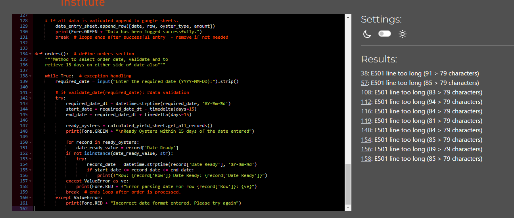

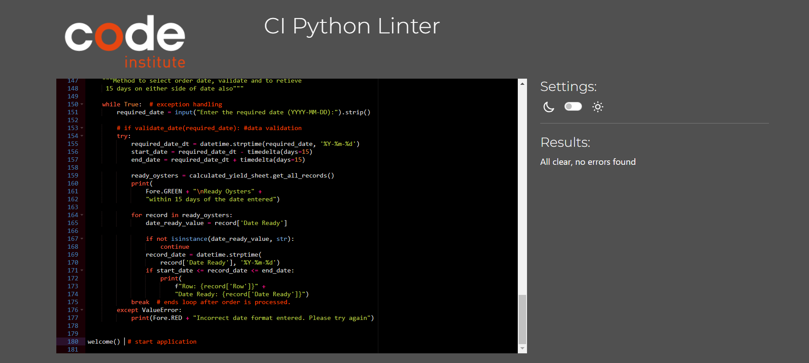

### Manual testing 

Testing the Data enty input.

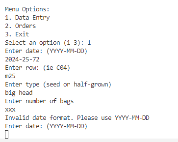        

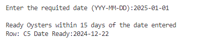     Testing the Orders retrieval feature. 

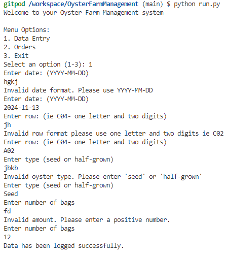     Testing invalid user feedback. 

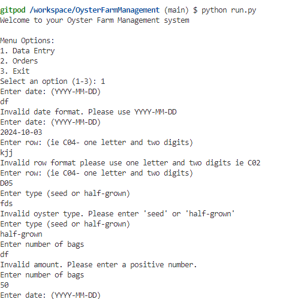    Second test to improve invalid user feedback. 

## Deployment

Deployed through Heroku [Heroku](https://id.heroku.com/)

1. Generate the reuirements.txt file
    - open terminal and run the following command to create a requirements.txt file that lists all installed packages:
        Pip3 > requirements.txt
2. Commit changes
    - After creating the requirements.txt file add it to Git repository
        git add requirements.txt
        git commit -m "Add requirements.txt"
3. Access Heroku
    - [Heroku](https://id.heroku.com/)
4. Create a new application
    - from dashbord click "create new app"
5. Configure your app
   - Enter a unique name for your application and select a region before clicking on "Create app". 
6. Set up Configuration variables
    - select settings tab and click Config Vars 
7. Add nessesary Config Vars
    - Click Reveal Config Vars and input the key value pair for Credentials
8. Specify the Port Confg
    - Aded second confg var with Key: PORT and VALUE: '8000'
9. Confg Buildpacks
    - Navigate to buildpacks select add builpack
10. Select Python buildpack
    - Select python and save
11. Deployment method
    - Select Deploy tab and select GitHub, click connect to GitHub. 
12. Connect to GitHub
    - search for your repository in the connect to github section and click connect next to it.
13. Deployment preference
    - Enable automatic deploys. 

## Credits

https://www.diffchecker.com/

using datetime in python :  https://www.dataquest.io/blog/python-datetime/

spreadsheets and pyton:https://realpython.com/openpyxl-excel-spreadsheets-python/

using datetime in python :  https://www.dataquest.io/blog/python-datetime/

https://stackoverflow.com/questions/9846683/how-to-install-colorama-in-python

https://www.geeksforgeeks.org/introduction-to-python-colorama/

https://github.com/josswe26/macro-calculator/blob/main/README.md?plain=1

https://stackoverflow.com/questions/62358444/how-to-format-a-datetime-so-google-sheets-recognise-the-value-as-date-time

Marcel my amazing Mentor 

Thomas from Tutor support

Lewis my Facilitator

